# 대학교 정보 제공 디스코드 

이 디스코드 봇은 대학교와 관련된 다양한 정보를 제공하는 봇입니다. 학비 정보, 캠퍼스 지도, 학과 정보, 동아리, 공지사항 등을 포함하며, 학과별 교육 연계도를 이미지로 보여주는 기능도 포함되어 있습니다.

---

## 주요기능

### 도움말 명령 (`/도움말`)
봇에서 사용할 수 있는 모든 명령어와 그 설명을 보여줍니다.

### 등록금 정보 (`/등록금`)
학과별 등록금 정보를 페이지 형식으로 제공합니다.

### 캠퍼스 지도 (`/캠퍼스지도`)
대학교 캠퍼스 지도를 이미지로 보여줍니다.

### 학점 비율 (`/학점비율`)
2025학년도 학점 분포 비율을 보여줍니다.

### 동아리 정보 (`/분과정보`)
동아리를 종류별로 분류하여 정보를 제공합니다.

### 공지사항 (`/공지사항`)
대학교 공식 웹사이트에서 최신 공지사항을 가져와 보여줍니다.

### 단과대학 및 학과 정보 (`/단과대학`)
단과대학과 해당 학과 정보를 탐색할 수 있으며, 학과별 교육 연계도 이미지를 확인할 수 있습니다.

---

## 실행 영상
[](https://youtu.be/lMA0QS28qN0)

---

## 코드 설명 및 구현 화면

---

### 명령어: `@bot.slash_command`
- 이 명령어를 통해 사용자는 `/`로 시작하는 명령어를 Discord 채팅에서 호출할 수 있습니다.

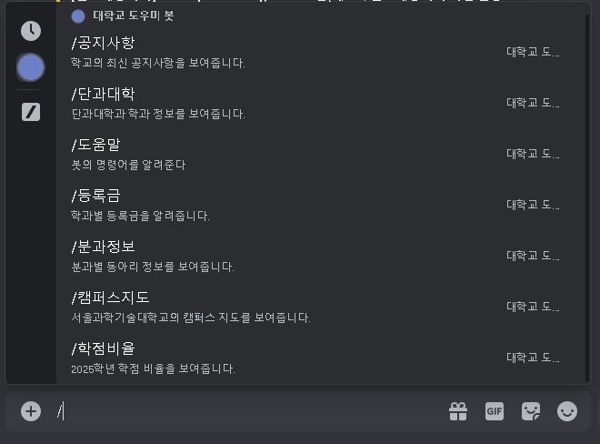

- Discord 채팅창에서 `/`를 입력했을 때 해당 봇이 지원하는 모든 슬래시 명령어가 자동으로 표시됩니다.

### 명령어: `/도움말`

```python
@bot.slash_command(name="도움말",description="봇의 명령어를 알려준다")
```

#### 설명
- 이 명령어는 봇에 등록된 모든 명령어를 보여줍니다.

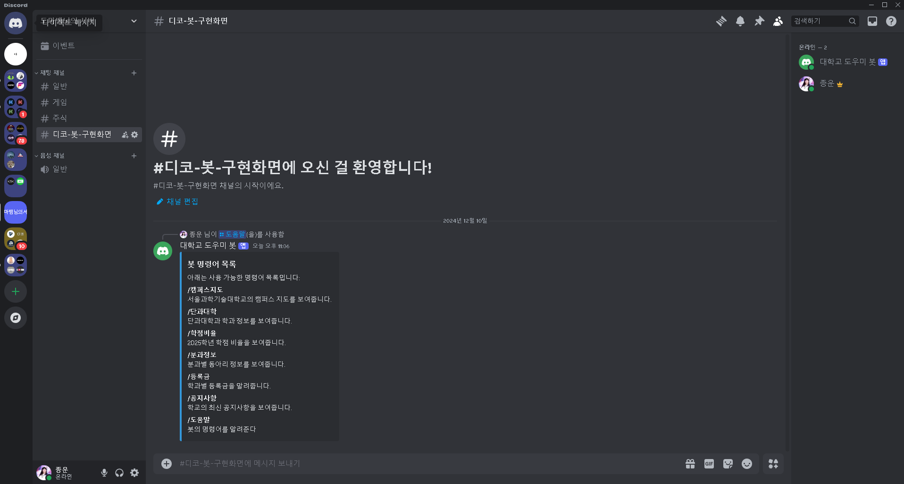

- 명령어의 이름과 그 설명이 포함된 임베드 메시지를 출력합니다.

### 명령어: `/등록금`

```python
@bot.slash_command(name="등록금", description="학과별 등록금을 알려줍니다.")
```

#### 설명
- 학과별 등록금 정보를 페이지별로 보여줍니다.

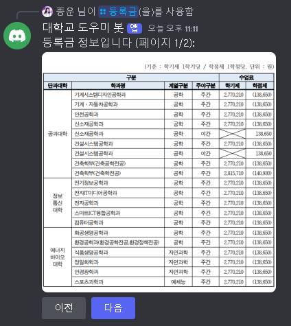

- "이전", "다음" 버튼으로 페이지를 이동할 수 있습니다.


- 버튼 정의 및 콜백 연결
   - `next_page_callback`: 다음 페이지를 표시
   - `prev_page_callback`: 이전 페이지를 표시
- 페이지 순환 로직: 페이지 번호를 배열 길이로 모듈러 연산하여 순환
- 버튼 뷰: `View`객체를 사용해 버튼을 생성하고 메시지에 추가

### 명령어: `/캠퍼스지도`

```python
@bot.slash_command(name="캠퍼스지도", description="서울과학기술대학교의 캠퍼스 지도를 보여줍니다.")
```

#### 설명
- 서울과학기술대학교 캠퍼스 지도를 이미지로 보여줍니다.

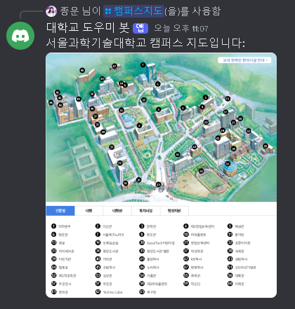

- `nextcord.File`: 이미지를 Discord 메시지에 첨부할 때 사용됩니다.

### 명령어: `/학점비율`

```python
@bot.slash_command(name="학점비율", description="2025학년 학점 비율을 보여줍니다.")
```

#### 설명
- 2025학년 학점 비율에 대한 정보를 보여줍니다.

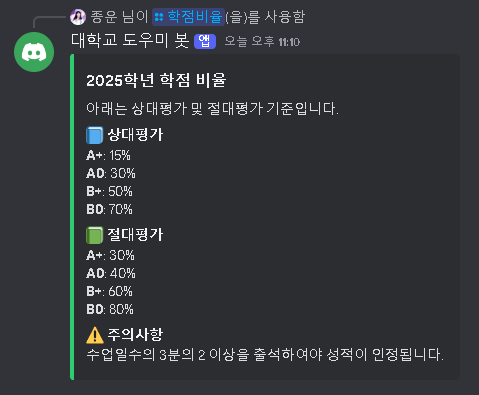

- 상대평가 및 절대평가 기준과 주의사항을 임베드 메시지로 출력합니다.
- 임베드 메시지 생성: 학점 비율 정보는 `Embed`에 추가.
- 상대평가/영어수 필드: 가독성을 위해 각각의 기준을 필드로 분리.

### 명령어: `/분과정보`

```python
@bot.slash_command(name="분과정보", description="분과별 동아리 정보를 보여줍니다.")
```

#### 설명
- 서울과학기술대학교의 분과별 동아리 정보를 제공합니다.

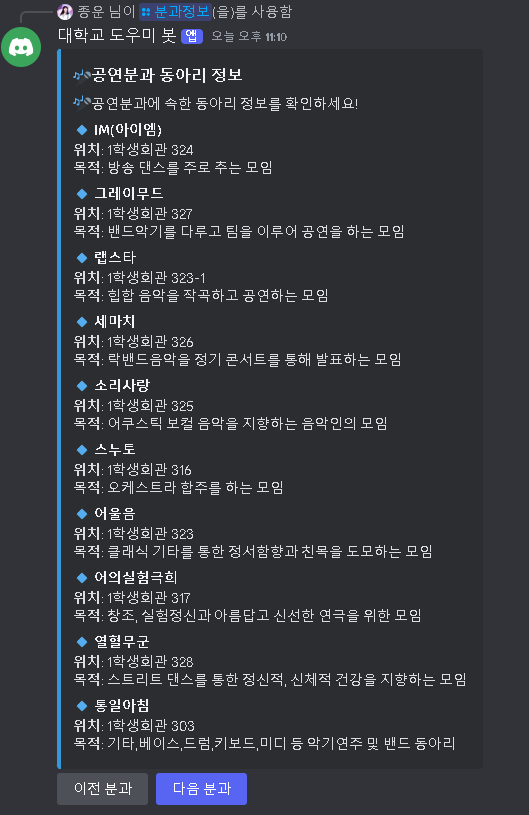

- 각 분과에 포함된 동아리의 이름, 위치, 그리고 목적을 임베드 메시지로 출력합니다.

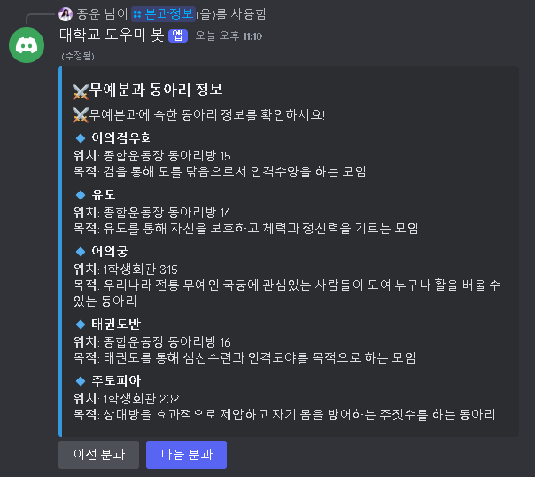

- "이전 분과", "다음 분과" 버튼을 통해 페이지를 이동하며 정보를 확인할 수 있습니다.
- 페이지 구조화
  - 동아리 정보를 분과별로 나눠 페이지로 구성.
  - 각 분과에는 이름, 위치, 목적 정보가 포함.
- 페이지 렌더링
   - `render_page(page_index)`: 현재 페이지의 동아리 정보를 임베드에 추가.
-버튼 네비게이션
   - `next_page_callback`: 다음 분과로 이동.
   - `prev_page_callback`: 이전 분과로 이동.
   - 버튼을 사용해 순활적으로 페이지 이동 가능.

### 명령어: `/공지사항`

```python
@bot.slash_command(name="공지사항", description="학교의 최신 공지사항을 보여줍니다.")
```

#### 설명
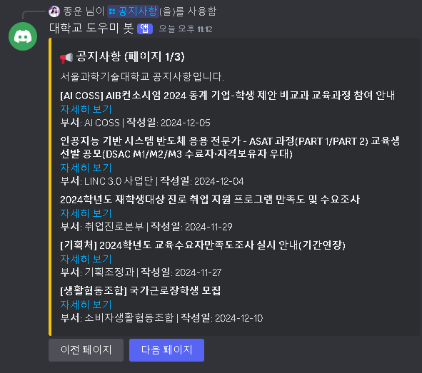

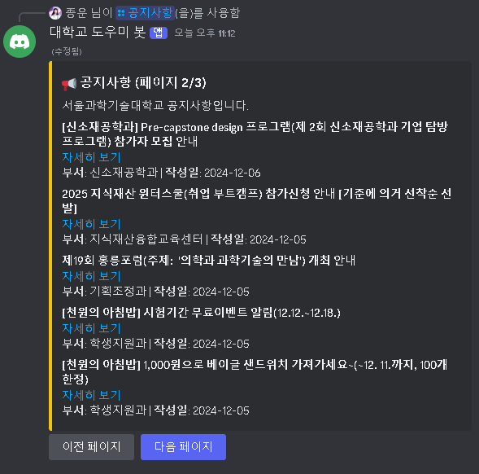

- 공지사항 크롤링
  - `fetch_notices()` 함수에서 공지사항 데이터(제목, 링크, 부서, 작성일)를 가져옵니다.
  - 최대 15개의 공지사항만 표시합니다.
-페이지 렌더링
  - `render_page(page_index)`: 현재 페이지에 해당하는 공지사항 데이터를 임베드에 추가합니다.
- 버튼 네비게이션
  - `next_page_callback`: 다음 페이지로 이동
  - `prev_page_callback`: 이전 페이지로 이동
  - 페이지는 순환 구조로 마지막 페이지에서 첫 번째 페이지로 이동 가능.
-임베드 메시지
  - 공지사항 제목과 링크, 부서, 작성일 정보를 포함.

### 명령어: `/단과대학`

```python
@bot.slash_command(name="단과대학", description="단과대학과 학과 정보를 보여줍니다.")
```

#### 설명
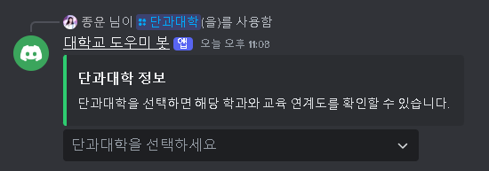

- 단과대학 선택
  - 사용자가 선택 메뉴에서 단과대학을 선택하면 해당 단과대학의 학과 목록이 표시됩니다.

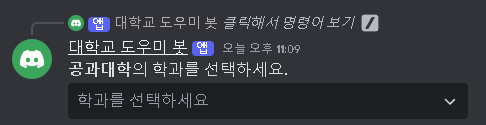

- 학과 선택
  - 학과 선택 시, 해당 학과의 교육 연계도 이미지가 전송됩니다.
  - `os.path.exists()`로 이미지 파일의 존재 여부를 확인합니다.
- 선택 메뉴
  - `Select`: 단과대학 및 학과 선택을 위한 드롭다운 메뉴를 생성.
  - `callback`: 사용자가 선택한 항목에 따라 동작을 정의.

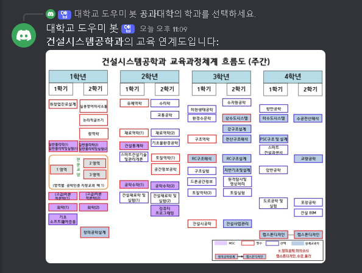

- 이미지 전송
  - 학과별로 사전에 정의된 이미지 경로(`collage_data`)를 기반으로 이미지를 전송합니다.

---

### 봇 실행 방법

1. **Discord Developer Portal에서 봇 생성**
   - [Discord Developer Portal](https://discord.com/developers/applications)에 접속합니다.
   - "New Application"을 클릭하고 봇의 이름을 입력하여 새 애플리케이션을 생성합니다.
   - 생성된 애플리케이션의 "Bot" 탭으로 이동하여 "Add Bot" 버튼을 클릭하여 봇 유저를 만듭니다.

2. **봇 토큰 가져오기**
   - "Bot" 탭에서 봇 토큰을 복사합니다.
   - 코드의 bot.run() 줄에 있는 "YOUR_BOT_TOKEN"을 복사한 토큰으로 교체합니다.

3. **봇 권한 설정**
   - Discord Developer Portal의 "OAuth2" 탭으로 이동합니다.
   - "URL Generator"를 선택한 후 아래 권한들을 선택합니다:
     - **Scopes**: `bot`
     - **Bot Permissions**: `Send Messages`, `Embed Links`, `Read Message History` 및 봇이 필요로 하는 기타 권한.
   - 생성된 OAuth2 URL을 복사합니다.

4. **봇을 서버에 초대**
   - 복사한 OAuth2 URL을 웹 브라우저에 열고 실행합니다.
   - 디스코드 서버를 선택한 후 봇을 초대합니다.

5. **Run the Bot**
   - 터미널을 열고 `seoultech.py` 파일이 있는 폴더로 이동합니다.
   - 다음 파일를 실행하여 봇을 시작합니다:
     ```bash
     seoultech.py
     ```
   - 이제 봇이 온라인 상태가 되어 사용할 준비가 완료됩니다.

---

## 실행 요건

1. **Python 3.8 이상**
   - Python 3.8 또는 그 이상의 버전이 필요합니다.
   - [Python 공식 웹사이트](https://www.python.org/)에서 다운로드하여 설치할 수 있습니다.

2. **필수 라이브러리 설치**
   - 다음 명령어를 실행하여 필요한 Python 라이브러리를 설치하세요:
     ```bash
     pip install nextcord aiohttp beautifulsoup4 requests
     ```
   - 각 라이브러리의 역할:
     - `nextcord`: 디스코드 API와 상호작용하기 위한 라이브러리.
     - `aiohttp`: 비동기 HTTP 요청을 처리하기 위한 라이브러리.
     - `beautifulsoup4`: HTML 파싱 및 크롤링에 사용.
     - `requests`: HTTP 요청을 처리하기 위한 라이브러리.
     - `os`: 파일 및 디렉토리 경로 관리를 하기 위한 라이브러리.
3. **이미지 폴더 설정**
   - 프로젝트 디렉토리에 `이미지/` 폴더를 생성합니다.
   - 해당 폴더에 **학과별 교육 연계도 이미지**와 **등록금 이미지**를 추가합니다.
     - 예시:
       ```plaintext
       프로젝트/
       ├── seoultech.py
       ├── 이미지/
       │   ├── 등록금1.png
       │   ├── 등록금2.png
       │   ├── 컴퓨터공학과.png
       │   └── 기계시스템디자인공학과.jpg
       ```
.

---

## 주의사항

절대 다른사람에게 자신의 토큰넘버를 알려주면 안됩니다.

---

## License

This project is licensed under the MIT License
